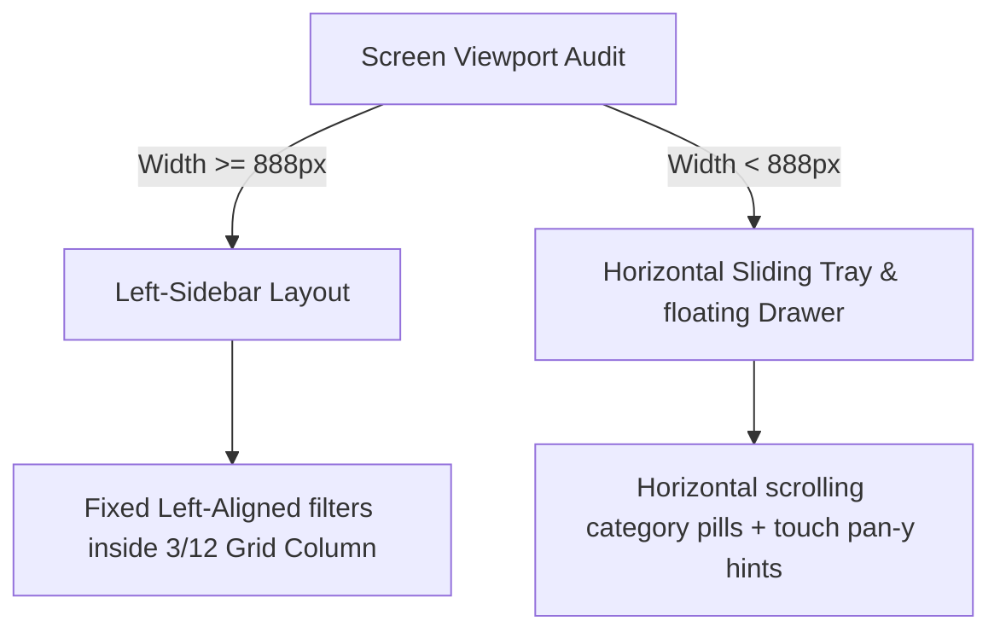

# Implementation Plan - Fully-Fledged Multipager & Left-Sidebar Portfolio UX

This plan outlines the architecture and execution steps to turn the merged `fts-oits-web-hybrid` repository into a true multipager, implementing standalone paths for Services, Portfolio, About Us, Contact Us, and Workflow (Process). It also details the Left-Sidebar Portfolio filtering system for larger screens (>888px) and advanced mobile filter UX.

## User Review Required

> [!IMPORTANT]
> The landing page at `/` will remain exactly as it is (showing all sections to preserve the cohesive home page experience), while standalone paths will serve dedicated, highly optimized pages:
> - `/services` -> Standalone Services Page
> - `/workflow` -> Standalone Agile Workflow Page (Process)
> - `/portfolio` -> Standalone Portfolio Page (with Sidebar filters)
> - `/about` -> Standalone About Us Page
> - `/contact` -> Standalone Contact Us Page

> [!WARNING]
> The **Services** menu item in the Header will be updated with a Swiss-Modern dropdown sub-menu (for desktop hover) and an accordion sub-list (for mobile) exposing:
> - **Services Home** (`/services`)
> - **Agile Workflow** (`/workflow`)

---

## Task 2: Responsive Left Sidebar Portfolio Filtering System

To provide standard enterprise portfolio UX for large viewports and optimal touch targeting on mobile devices, we will implement the following:

### A. Large Viewports (>= 888px)
- The Portfolio section (on both the Home page and the Portfolio page) will use a **12-column grid layout**.
- **Left Column (`col-span-3`)**: Occupied by a rigid, high-density left sidebar containing:
  - Header badge and title (`Filters`)
  - Vertical stack of Categories with clean uppercase lettering, subtle grid lines, and interactive counts
  - Vertical stack of Status filters
  - A clean "Reset Filters" action button
- **Right Column (`col-span-9`)**: The portfolio grid showing animated project cards.

### B. Viewports (< 888px)
- **Horizontal Sliding Tray**: A smooth horizontal scroll wrapper (`flex overflow-x-auto no-scrollbar touch-action: 'pan-x'`) allowing rapid selection of categories.
- **Floating Bottom Sheet**: A compact "Filter Options" floating action button (FAB) at the bottom center. When tapped, it slides up an elegant drawer containing all categorizations and multi-select toggles. This prevents cluttered layouts on mobile devices.

---

## Proposed Changes

### Component 1: Routing & Infrastructure

#### [MODIFY] [App.tsx](file:///c:/FTS/NovoRepo_FOITS/OITS_WEB/fts-oits-web-hybrid/App.tsx)
- Wire the routes: `/`, `/services`, `/portfolio`, `/about`, `/contact`, `/workflow`, and `/editorial-showcase`.
- Integrate a global `<ScrollToTop />` route listener to restore page scrolls on navigation.

#### [NEW] [ScrollToTop.tsx](file:///c:/FTS/NovoRepo_FOITS/OITS_WEB/fts-oits-web-hybrid/components/ScrollToTop.tsx)
- Lightweight utility component invoking `window.scrollTo(0, 0)` upon route transition.

---

### Component 2: Standalone Pages

#### [NEW] [ServicesPage.tsx](file:///c:/FTS/NovoRepo_FOITS/OITS_WEB/fts-oits-web-hybrid/components/ServicesPage.tsx)
- Standalone page wrapping the `Services` component with custom sub-hero headers and visual tokens.

#### [NEW] [PortfolioPage.tsx](file:///c:/FTS/NovoRepo_FOITS/OITS_WEB/fts-oits-web-hybrid/components/PortfolioPage.tsx)
- Dedicated portfolio explorer showing the high-density sidebar project grids.

#### [NEW] [AboutPage.tsx](file:///c:/FTS/NovoRepo_FOITS/OITS_WEB/fts-oits-web-hybrid/components/AboutPage.tsx)
- Standalone company page detailing mission, value cards, and team rosters.

#### [NEW] [ContactPage.tsx](file:///c:/FTS/NovoRepo_FOITS/OITS_WEB/fts-oits-web-hybrid/components/ContactPage.tsx)
- Full-screen high-conversion contact page with interactive estimation blocks.

#### [NEW] [WorkflowPage.tsx](file:///c:/FTS/NovoRepo_FOITS/OITS_WEB/fts-oits-web-hybrid/components/WorkflowPage.tsx)
- Independent page wrapping the dynamic `Process` (Workflow) stages.

---

### Component 3: Navigation & Footer Updates

#### [MODIFY] [Header.tsx](file:///c:/FTS/NovoRepo_FOITS/OITS_WEB/fts-oits-web-hybrid/components/Header.tsx)
- Port main links to React Router `<Link>` or conditional navigations.
- Implement desktop hover dropdown sub-menus for "Services" -> (Services Home, Workflow) using Framer Motion / CSS slide transitions.
- Build mobile accordion toggle handlers.

#### [MODIFY] [Footer.tsx](file:///c:/FTS/NovoRepo_FOITS/OITS_WEB/fts-oits-web-hybrid/components/Footer.tsx)
- Refactor anchor tags to use absolute paths matching the new routing schema.

---

### Component 4: Layout & Grid Styling

#### [MODIFY] [Portfolio.tsx](file:///c:/FTS/NovoRepo_FOITS/OITS_WEB/fts-oits-web-hybrid/components/Portfolio.tsx)
- Restructure the parent container grid using conditional styling.
- Add `useWindowSize` or media-matching state listener to perfectly switch columns at `888px`.
- Implement mobile horizontal sliding tray and clean drawer layouts.

---

## Verification Plan

### Automated Tests
- Run `npm run lint` (`tsc --noEmit`) to verify that all React Router imports and state parameters satisfy strict TypeScript rules.
- Run `npm run build` to verify Vite assets successfully compile without chunk issues.

### Manual Verification
- Deploy dev server to inspect responsiveness exactly above and below `888px` on simulated viewports.
