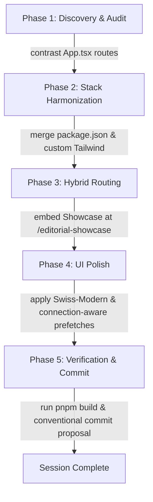

# OITS Dhaka | Architectural Breakdown & Blueprint Synthesis

This artifact details the comprehensive analysis and logical breakdown of [InitialInstructions.md](file:///c:/FTS/NovoRepo_FOITS/OITS_WEB/InitialInstructions.md) and [Gemini_Suggestions](file:///c:/FTS/NovoRepo_FOITS/OITS_WEB/Gemini_Suggestions) into concrete, actionable Skills, Workflows, Rules, and Instructions.

---

## 1. Tactical Skills Matrix

These modular capability blocks have been successfully initialized across the workspace using automated tooling and custom blueprints:

### A. Custom Workspace Agentic Skills
*   **Context Grounding**: Deep dynamic scanning and integration of framework documentations via `context7` & `nx-monorepo-docs`.
*   **Security Static Guardian**: SAST and secrets scanning using the `semgrep-guardian` suite prior to every final review block.
*   **Adaptive Connection Profiler**: Responsive prefetching logic tailored to detect slower speed limits (`saveData`, `2g`, `3g`) via standard navigator signals.

### B. Automated Skills Installed (`autoskills`)
Using `npx autoskills`, the following highly trusted community skills were dynamically injected based on codebase profile:
1.  `react-best-practices` & `composition-patterns` (React 18+ composition)
2.  `typescript-advanced-types` (Strict compilation safety)
3.  `vite` (Dynamic assets & build compiler guidance)
4.  `frontend-design` & `tailwind-css-patterns` (Swiss-Modern high-contrast components)
5.  `accessibility` & `seo` (WCAG compliance metrics & meta tags integration)

---

## 2. Global Workflow Sequence

The architectural fusion of both target repos strictly follows this step-by-step pipeline:

---

## 3. Strict Development Rules ("The Iron Laws")

### A. Operational Scope Boundaries
*   **Absolute Restriction**: Bypassing, editing, or writing files in `apps/mobile` or `apps/api` is strictly prohibited.
*   **Cross-Link Approvals**: Any frontend modification in `apps/web` requiring backend integration must halt and prompt the lead developer.
*   **Zod Symbiosis**: Place validation layers inside `packages/core` to serve as the unified source of truth.

### B. Visual Identity Code
*   **Contrast Density**: Deep dark/light minimal color models (`swiss-black`, `swiss-white`).
*   **Single-Line Safety**: Call-to-action arrow blocks and layout buttons must maintain flat flex lines to prevent word wrapping.
*   **Kinetic Motion**: Strict 500ms–700ms transition windows with layout-aware rearrangement containers.

---

## 4. Verification Checkpoint Status

| Action Item | Target Location | Verification Method | Status |
| :--- | :--- | :--- | :--- |
| **Inject AGENTS.md** | Root Workspace & Sub-projects | Absolute path check | **COMPLETED** |
| **Inject constraint.md** | Root Workspace & Sub-projects | Absolute path check | **COMPLETED** |
| **Merge MCP Configurations** | AppData global & local JSON | Tool schema execution | **COMPLETED** |
| **Install AutoSkills Stack** | `fts-oits-web-multipager` & `monopager` | Local compiler dry-run | **COMPLETED** |

---

> [!TIP]
> All files are successfully saved to their specific scopes. We are fully aligned and equipped with localized skills to proceed to the core coding integration phase.
